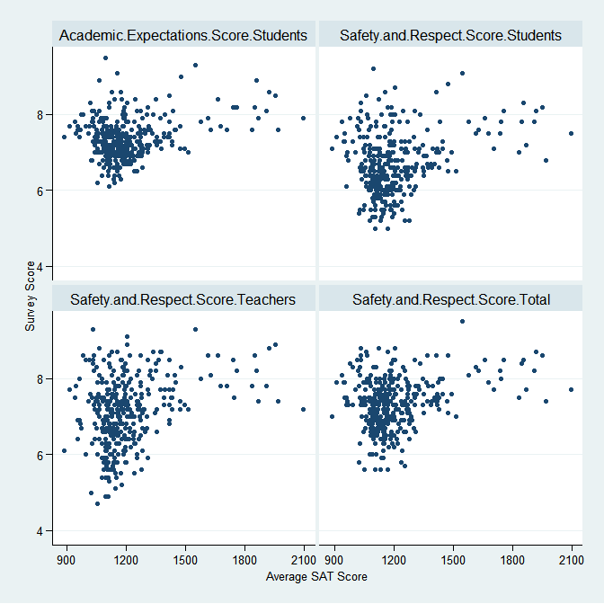
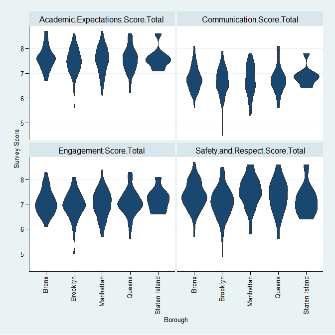
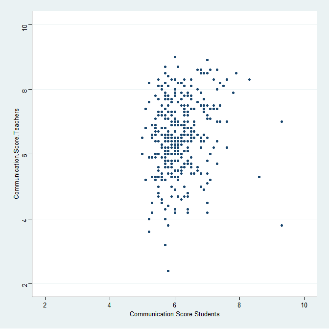

## Introduction

This project explores the perceptions of high school quality in NYC according to students, teachers and parents. 

## Datasets

The datasets used in this analysis were obtained from:

* [data.world](https://data.world/dataquest/nyc-schools-data/workspace/file?filename=combined.csv)
* [NYC OpenData](https://data.cityofnewyork.us/Education/2011-NYC-School-Survey/mnz3-dyi8)

Data was imported into R as dataframes using:


```r
demographic <- read_csv('combined.csv')
gened_survey <- read_tsv('masterfile11_gened_final.txt')
d75_survey <- read_tsv('masterfile11_d75_final.txt')
```

The `demographic` dataset contains demographic and academic success metrics for NYC schools. The `gened_survey` and `d75_survey` datasets contain survey results from 2011 for "general education" and District 75 schools, respectively. District 75 schools provide special education support for children with special needs.

## Data Cleaning

The "general education" survey dataset was filtered to only include high school survey results. Both survey datasets were simplified to focus on aggregate survey scores for each school.

```r
gened_simp <- gened_survey %>%
  filter(schooltype == "High School") %>%
  select(dbn:aca_tot_11)

d75_simp <- d75_survey %>%
  select(dbn:aca_tot_11)
```

The two survey datasets were combined into a single dataframe and then joined with the demographic dataset based on the school's DBN. A left join was used here to only retain survey results for schools where demographic data is also available.

```r
surveys <- gened_simp %>%
  bind_rows(d75_simp) %>%
  rename(DBN = dbn)

combined <- demographic %>%
  left_join(surveys)
```

Survey score columns were renamed to improve readability.

```r
combined <- combined %>%
  rename_all(funs(str_replace(., "aca_", "Academic.Expectations."))) %>%
  rename_all(funs(str_replace(., "com_", "Communication."))) %>%
  rename_all(funs(str_replace(., "eng_", "Engagement."))) %>%
  rename_all(funs(str_replace(., "saf_", "Safety.and.Respect."))) %>%
  rename_all(funs(str_replace(., "tot_11", "Score.Total"))) %>%
  rename_all(funs(str_replace(., "p_11", "Score.Parents"))) %>%
  rename_all(funs(str_replace(., "s_11", "Score.Students"))) %>%
  rename_all(funs(str_replace(., "t_11", "Score.Teachers")))
```


## Exploratory Data Analysis

#### Correlation between survey results and academic success metrics

To investigate whether student, teacher and parent perceptions of NYC school quality are related to academic success metrics (average SAT scores), a correlation matrix was constructed to look for relationships in the combined dataset.


```r
corr <- combined %>%
  select(avg_sat_score,
         Safety.and.Respect.Score.Parents:Academic.Expectations.Score.Total) %>%
  cor(use = "pairwise.complete.obs") %>%
  as_tibble(rownames = "variable")
```

The correlation matrix was filtered to focus on stronger correlations (absolute value greater than 0.25), resulting in 4 relationships that warrant further analysis as summarized in Table 1.


```r
corr_strong <- corr %>%
  select(variable, avg_sat_score) %>%
  filter((avg_sat_score > 0.25 | avg_sat_score < -0.25) & variable != "avg_sat_score")
```

**Table 1. Correlations between survey results and average SAT scores.**

---------------------------------------------------------------------
           Survey Question              Correlation to Avg SAT Score 
-------------------------------------- ------------------------------
  Safety.and.Respect.Score.Teachers                0.3091            

  Safety.and.Respect.Score.Students                0.2773            

 Academic.Expectations.Score.Students              0.2926            

    Safety.and.Respect.Score.Total                 0.276             
---------------------------------------------------------------------

Scatter plots were created to visualize these correlations (Figure 1). From the plots, it can be seen that high schools with higher average SAT scores (above 1500) generally have higher perceived quality (survey scores greater than or equal to 7 out of 10).



**Figure 1. Correlation between average SAT scores and perceived quality in NYC high schools according to survey results.**

#### Effect of school location on survey results

Violin plots (Figure 2) were constructed to visualize the variation in total survey scores (combination of student, teacher and parent responses) across different NYC boroughs. From the plots, it can be seen that Staten Island schools typically received high quality scores. Schools in Brooklyn had the greatest spread in survey responses, and also some of the lowest quality scores. 


**Figure 2. Total survey scores (combination of student, teacher and parent responses) in different NYC boroughs.**

#### Differences in perceived quality between respondent groups

To assess if there are any differences in perceived school quality between the various respondent groups (parents, teachers, students), several correlation matrices were constructed (one for each survey category).


```r
create_corr <- function(score_str) {
  combined %>%
    select(contains(score_str)) %>%
    select(-contains("Total")) %>%
    rename_all(funs(str_replace(., paste(score_str, "Score.", sep = "."), ""))) %>%
    cor(use = "pairwise.complete.obs") %>%
    as_tibble(rownames = NA)
}

corr_aca <- create_corr("Academic.Expectations")
corr_com <- create_corr("Communication")
corr_eng <- create_corr("Engagement")
corr_saf <- create_corr("Safety.and.Respect")
```

**Table 2. Academic score: Correlations between parent, student and teacher responses.**

----------------------------------------------
    &nbsp;      Parents   Teachers   Students 
-------------- --------- ---------- ----------
 **Parents**       1       0.4191     0.6798  

 **Teachers**   0.4191       1        0.4089  

 **Students**   0.6798     0.4089       1     
----------------------------------------------

**Table 3. Communication score: Correlations between parent, student and teacher responses.**

----------------------------------------------
    &nbsp;      Parents   Teachers   Students 
-------------- --------- ---------- ----------
 **Parents**       1       0.2412     0.5688  

 **Teachers**   0.2412       1        0.1683  

 **Students**   0.5688     0.1683       1     
----------------------------------------------

**Table 4. Engagement score: Correlations between parent, student and teacher responses.**

----------------------------------------------
    &nbsp;      Parents   Teachers   Students 
-------------- --------- ---------- ----------
 **Parents**       1       0.3297     0.6076  

 **Teachers**   0.3297       1        0.3578  

 **Students**   0.6076     0.3578       1     
----------------------------------------------

**Table 5. Safety and Respect score: Correlations between parent, student and teacher responses.**

----------------------------------------------
    &nbsp;      Parents   Teachers   Students 
-------------- --------- ---------- ----------
 **Parents**       1       0.4905     0.7324  

 **Teachers**   0.4905       1        0.5922  

 **Students**   0.7324     0.5922       1     
----------------------------------------------

The communication score (Table 3) shows the lowest correlations between correspondent groups compared to the other survey results. In particular, the correlation between student and teacher response is quite low. Taking a look at this further (in Figure 3), it can be seen that teacher responses are often lower than the corresponding student response.


**Figure 3. Relationship between student and teacher responses in the communication survey questions.**

## Future Work

Suggestions for future work include:

- Comparison of survey results with high school graduation rates and other demographic data, including poverty level.
- A detailed look at the highest and lowest scoring schools.
